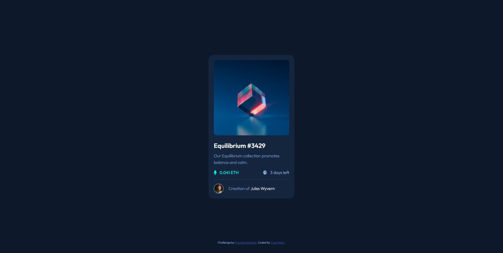

# Frontend Mentor - NFT preview card component solution

This is a solution to the [NFT preview card component challenge on Frontend Mentor](https://www.frontendmentor.io/challenges/nft-preview-card-component-SbdUL_w0U). Frontend Mentor challenges help you improve your coding skills by building realistic projects. 

## Table of contents

- [Frontend Mentor - NFT preview card component solution](#frontend-mentor---nft-preview-card-component-solution)
  - [Table of contents](#table-of-contents)
  - [Overview](#overview)
    - [The challenge](#the-challenge)
    - [Screenshot](#screenshot)
    - [Links](#links)
  - [My process](#my-process)
    - [Built with](#built-with)
  - [Author](#author)

## Overview

### The challenge

Users should be able to:

- View the optimal layout depending on their device's screen size
- See hover states for interactive elements

### Screenshot

### Links

- Solution URL: [https://www.frontendmentor.io/solutions/nft-card-landing-page-fYSrFvA1M](https://www.frontendmentor.io/solutions/nft-card-landing-page-fYSrFvA1M)
- Live Site URL: [https://crazywolv.github.io/nft-card/](https://crazywolv.github.io/nft-card/)

## My process

### Built with

- Semantic HTML5 markup
- CSS custom properties

## Author

<!-- - Website - [Add your name here](https://www.your-site.com) -- Still coding this one -->
- Frontend Mentor - [@CrazyWolv](https://www.frontendmentor.io/profile/CrazyWolv)
